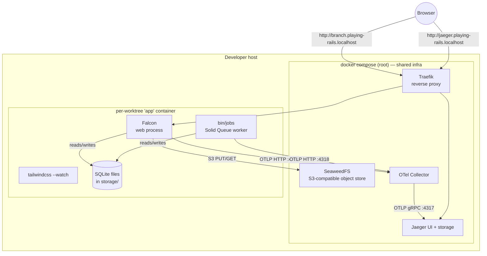
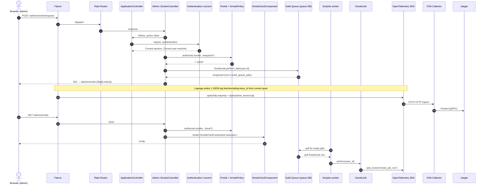
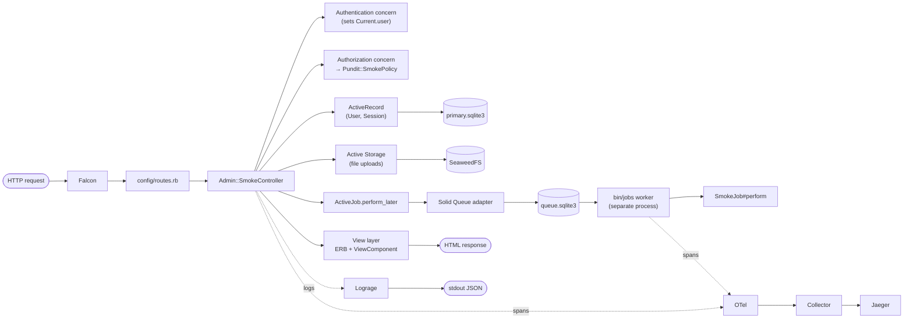
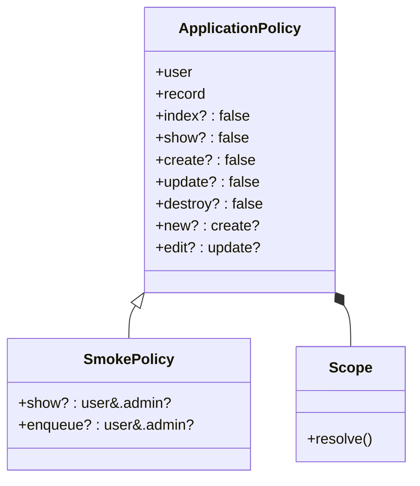
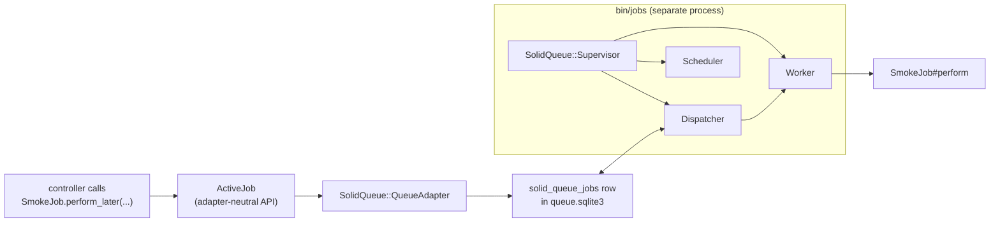
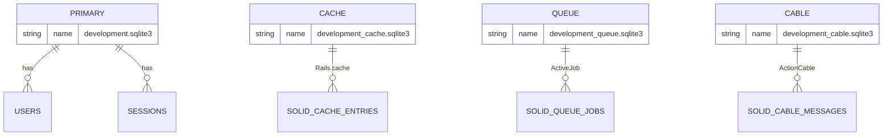
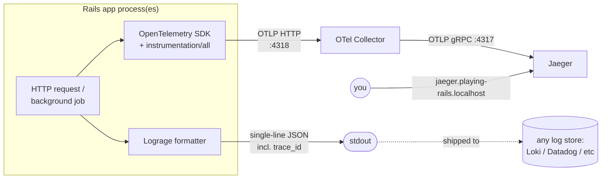
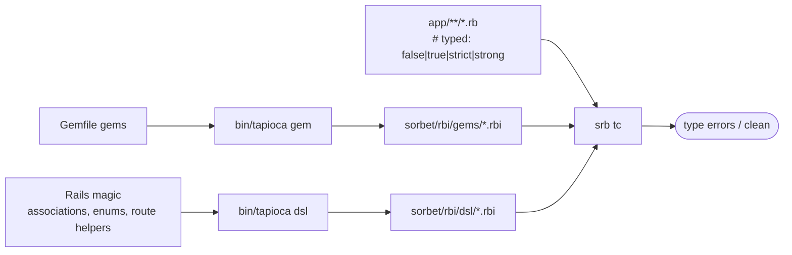
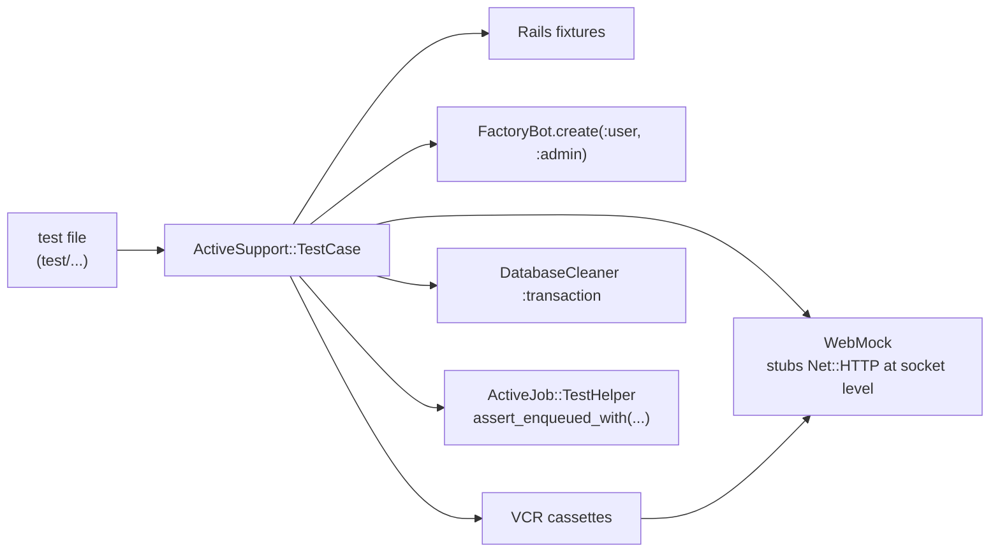

# The Rails Way, by Layer

A self-contained tour of a modern Rails 8.1 stack as wired up in this repo, written for an experienced TypeScript / Node architect who already knows web fundamentals but is new to Rails idioms.

The repo is a learning POC ("LinkedIn-lite"). What's currently committed is **not** the product features — it's the **stack scaffolding plus a single trivial route (`/admin/smoke`)** that exercises every mandated technology end-to-end before feature work begins. This document explains what each piece is, why Rails picks it, and how the pieces connect.

---

## 0. The mandated stack at a glance

| Concern | Choice | TypeScript-world analogue |
|---|---|---|
| App server | **Falcon** (fiber-based) | Node's event loop, but for Ruby |
| Database | **SQLite** (multi-DB) | SQLite, split logically per concern |
| Background jobs | **Solid Queue** | BullMQ, but using SQLite as the broker |
| Cache / Cable | **Solid Cache / Solid Cable** | Redis-cache / WebSocket pub-sub on SQLite |
| Frontend | **Hotwire (Turbo + Stimulus)** | HTMX-shaped SPA, no React build step |
| Components | **ViewComponent** | React component (sandboxed, testable) |
| Authorization | **Pundit** | CASL or similar policy lib |
| Static typing | **Sorbet + Tapioca** | TypeScript with auto-generated `.d.ts` |
| Tests | **Minitest** + FactoryBot + VCR + WebMock + DatabaseCleaner | Vitest + factory-bot + nock + cassettes |
| Logs | **Lograge** (one JSON line/request) | pino with structured output |
| Traces | **OpenTelemetry → OTel Collector → Jaeger** | Same OTel stack |
| Object store | **SeaweedFS** (S3-compatible, local) | MinIO |
| Authentication | Rails 8 built-in `has_secure_password` + `Session` | next-auth's credentials provider, hand-rolled |

> **Mental model**: Rails leans hard on **convention over configuration**. Each "concern" above has a canonical place in the directory tree, a canonical naming scheme, and a canonical wiring point. Once you internalize the conventions, an unfamiliar Rails app is navigable without a README.

---

## 1. Process & container topology

This is what runs where.



**Key idea**: Infra is **decoupled from the app**. One Compose file at the repo root brings up Traefik / SeaweedFS / OTel / Jaeger and stays up across branches. Each worktree (git branch) gets its own `app` container that joins the shared Docker network. This is enforced via `${PROJECT_NAME}-${BRANCH_NAME}` naming so two branches running in parallel don't collide on bucket names, service names, or trace streams.

`bin/dev` (Procfile.dev) launches three foreground processes inside the `app` container: **Falcon** (web), **Tailwind watcher** (CSS rebuild), **bin/jobs** (Solid Queue worker).

---

## 2. The request flow — what touches what

This is the `/admin/smoke` round trip. Trace it once and you've seen every layer:



What this proves on a single click:
- **Falcon** routes a real HTTP request.
- **Authentication concern** populates `Current.user`.
- **Pundit policy** denies/allows.
- **Solid Queue** persists the job to the *queue* database (separate from the *primary* one).
- **bin/jobs** picks the job up and runs it in a different process.
- **Lograge** emits a structured log with the active **trace_id**.
- **OpenTelemetry** auto-instrumentation captures HTTP + SQL + job spans and ships them to Jaeger.

---

## 3. Layer-by-layer responsibility map



### 3.1 Routing — `config/routes.rb`

```ruby
namespace :admin do
  get  "smoke",         to: "smoke#show",    as: :smoke
  post "smoke/enqueue", to: "smoke#enqueue", as: :smoke_enqueue
end
root "admin/smoke#show"
```

- `namespace :admin` produces URL prefix `/admin/...`, controller class `Admin::SmokeController`, view path `app/views/admin/smoke/`, and route helpers `admin_smoke_path`, `admin_smoke_enqueue_path`.
- Express analogue: `app.use('/admin', adminRouter)` plus a path-helper code-gen layer.

### 3.2 Controller — `app/controllers/admin/smoke_controller.rb`

```ruby
class Admin::SmokeController < ApplicationController
  before_action :require_authentication
  def show    = authorize :smoke, :show?
  def enqueue
    authorize :smoke, :enqueue?
    SmokeJob.perform_later(Current.user.id)
    redirect_to admin_smoke_path, notice: "Smoke job enqueued."
  end
end
```

`before_action` is the Rails middleware-per-controller hook. `ApplicationController` includes the two cross-cutting concerns below.

### 3.3 Authentication — `app/controllers/concerns/authentication.rb`

A "concern" is a Ruby module designed for `include`-style mixin. This one is unchanged from the Rails 8 generator: it loads a `Session` row from a signed cookie, assigns it to `Current.session`, and exposes `Current.user`.

`Current` (`app/models/current.rb`) is a `CurrentAttributes` subclass — Rails' built-in, request-scoped thread-local store. Per-request actor without prop-drilling.

### 3.4 Authorization — `app/controllers/concerns/authorization.rb`

```ruby
module Authorization
  extend ActiveSupport::Concern
  included do
    include Pundit::Authorization
    rescue_from Pundit::NotAuthorizedError, with: :forbidden

    private
    def pundit_user = Current.user        # Pundit defaults to current_user; override
    def forbidden   = render plain: "Forbidden", status: :forbidden
  end
end
```

Pundit looks up `<Resource>Policy#<action>?` and either returns or raises. The `rescue_from` translates the raise into HTTP 403.

#### Policy structure



- **Deny by default**: every base-class action returns `false`. You explicitly opt into permissions.
- **Scopes** restrict collection queries (e.g. "members can only list their own posts"). Not used yet by SmokePolicy but the structure is in place.

### 3.5 Models — ActiveRecord + enums

```ruby
class User < ApplicationRecord
  enum :role, { member: 0, recruiter: 1, admin: 2 }
  has_secure_password
  has_many :sessions, dependent: :destroy
end
```

- **`enum`** stores the column as integer but exposes symbolic API: `user.admin?`, `user.update!(role: :recruiter)`, `User.member.where(active: true)`.
- **`has_secure_password`** plugs in BCrypt + `password=`/`authenticate` methods. Standard Rails pattern.
- The `active` boolean is the lifecycle flag — the spec forbids hard delete; users are deactivated/reactivated.

### 3.6 View layer — ERB + ViewComponent

ERB is Rails' default templating (like JSX inside `.erb` files). A **ViewComponent** is a sandboxed, testable Ruby class with a sidecar template:

```
app/components/smoke_card_component.rb         # the class
app/components/smoke_card_component.html.erb   # its template
```

```ruby
class SmokeCardComponent < ViewComponent::Base
  def initialize(user:)
    @user = user
  end
  attr_reader :user
end
```

Used as `<%= render SmokeCardComponent.new(user: Current.user) %>`.

Why bother instead of partials?

| | Partial | ViewComponent |
|---|---|---|
| Inputs | Implicit locals | Explicit `initialize(...)` |
| Helpers | All view helpers in scope by default | Sandboxed; access via `helpers.…` |
| Test | Needs a controller + render | Plain `render_inline(Component.new(...))` |
| Reuse | Fine for trivial markup | Built for design-system primitives |

TS analogue: a partial is an `<%= include 'header' %>`; a ViewComponent is a typed React component.

### 3.7 Jobs — ActiveJob + Solid Queue

```ruby
class SmokeJob < ApplicationJob
  queue_as :default
  def perform(user_id)
    Rails.logger.info({ event: "smoke_job", user_id: user_id }.to_json)
    OpenTelemetry::Trace.current_span&.add_event("smoke_job_ran")
  end
end
```

ActiveJob is Rails' adapter abstraction (think "queue-agnostic interface"); **Solid Queue** is the concrete adapter that uses SQLite as the broker.



The supervisor `fork()`s its child processes; this matters for OpenTelemetry — see §5.

### 3.8 Storage — Active Storage + SeaweedFS

`config/storage.yml` defines a `seaweed` service:

```yaml
seaweed:
  service: S3
  endpoint: <%= ENV.fetch("S3_ENDPOINT", "http://seaweedfs:8333") %>
  access_key_id: <%= ENV.fetch("S3_ACCESS_KEY_ID", "any") %>
  secret_access_key: <%= ENV.fetch("S3_SECRET_ACCESS_KEY", "any") %>
  region: <%= ENV.fetch("S3_REGION", "us-east-1") %>
  bucket: <%= ENV.fetch("S3_BUCKET", "playing-rails-#{ENV['BRANCH_NAME'] || 'main'}") %>
  force_path_style: true
```

`config.active_storage.service = :seaweed` activates it in dev + prod.

`force_path_style: true` is required for most S3 emulators — the AWS SDK defaults to virtual-hosted-style URLs (`bucket.s3.amazonaws.com`) which don't resolve against a local container.

`lib/tasks/storage.rake` provides `bin/rails storage:ensure_bucket` — idempotent bucket creation, called from `bin/setup` so a fresh checkout is one command away from working uploads.

---

## 4. Multi-database SQLite (Solid Trifecta)

Rails 8 ships **Solid Cache, Solid Queue, Solid Cable** — drop-in replacements for Redis-backed cache, queue, and WebSocket pub-sub, all running on SQLite. Each runs in its **own SQLite file** to avoid writer-lock contention with the application's hot tables.



Wiring in `config/environments/development.rb`:

```ruby
config.active_job.queue_adapter = :solid_queue
config.solid_queue.connects_to = { database: { writing: :queue } }
```

`connects_to` is Rails' multi-DB routing API — it tells the model (here, Solid Queue's models) to reach for the `:queue` database defined under `config/database.yml`.

> **Why SQLite for everything in 2026?** Litestream-style replication + WAL + a single deploy artifact have made SQLite a credible production choice for moderate-traffic apps. Splitting concerns across files preserves SQLite's "one writer at a time" property without it bottlenecking hot paths. For the learning POC, it removes the Redis dependency entirely.

---

## 5. Observability pipeline

Two outputs, one request.



### 5.1 Lograge — `config/initializers/lograge.rb`

Replaces Rails' default 5-line-per-request log noise with one structured JSON line, including the OpenTelemetry trace_id so logs can be joined to traces:

```ruby
config.lograge.enabled = ENV["LOGRAGE_ENABLED"] != "false"
config.lograge.formatter = Lograge::Formatters::Json.new
config.lograge.custom_options = lambda do |event|
  {
    time: event.time,
    params: event.payload[:params]&.except("controller", "action"),
    trace_id: OpenTelemetry::Trace.current_span&.context&.hex_trace_id
  }
end
```

### 5.2 OpenTelemetry — `config/initializers/opentelemetry.rb`

`use_all` plugs in auto-instrumentations for ActionPack, ActiveRecord, Faraday, Net::HTTP, etc. Then this **post-fork hygiene** matters for Solid Queue:

```ruby
if defined?(SolidQueue)
  reinit = -> do
    provider = OpenTelemetry.tracer_provider
    next unless provider.respond_to?(:add_span_processor)
    provider.instance_variable_set(:@span_processors, [])
    provider.add_span_processor(
      OpenTelemetry::SDK::Trace::Export::BatchSpanProcessor.new(
        OpenTelemetry::Exporter::OTLP::Exporter.new
      )
    )
  end
  SolidQueue.on_worker_start(&reinit)
  SolidQueue.on_dispatcher_start(&reinit)
  SolidQueue.on_scheduler_start(&reinit)
end
```

**Why**: Solid Queue's supervisor `fork()`s its workers/dispatcher/scheduler. The OTLP HTTP exporter caches a `Net::HTTP` socket. Post-fork, parent and child share that fd and exports collide. Replacing the entire `tracer_provider` would invalidate already-installed instrumentations (which cached the old provider's tracer). Instead: keep the provider, swap a fresh BSP + exporter onto it inside each forked child.

### 5.3 OTel Collector — `config/otel-collector.yaml`

Decouples the app from the trace backend. The app speaks OTLP to the collector; the collector forwards to Jaeger. Swap Jaeger for Honeycomb / Tempo / Datadog by editing this one file — the app changes nothing.

```yaml
receivers:
  otlp: { protocols: { grpc: ..., http: ... } }
exporters:
  otlp/jaeger: { endpoint: jaeger:4317, tls: { insecure: true } }
service:
  pipelines:
    traces: { receivers: [otlp], exporters: [otlp/jaeger] }
```

---

## 6. Sorbet + Tapioca (gradual typing for Ruby)



- **Sorbet** is Stripe's static type checker. The strictness ladder is `# typed: ignore` → `false` → `true` → `strict` → `strong`.
- Every file in this commit got `# typed: false` — tracked but not yet checked. This is the canonical "first-pass adoption" move.
- **Tapioca** generates RBI ("Ruby Interface", like `.d.ts`) files for installed gems and Rails DSL magic that Sorbet can't infer (e.g. `User.admin?` from the enum, `admin_smoke_path` from the router).
- Run `bundle exec srb tc` to type-check, `bundle exec tapioca gem` after adding a gem, `bundle exec tapioca dsl` after schema/route changes.

TS analogue: introducing TS into a JS repo with `allowJs: true, checkJs: false`, then ratcheting individual files up to `// @ts-check`.

---

## 7. Test toolchain



### Roles

| Tool | Role |
|---|---|
| **Minitest** | Test runner (Rails default; no RSpec here) |
| **FactoryBot** | Declarative test data with traits — `create(:user, :admin)` |
| **WebMock** | Block any unstubbed outbound HTTP; tests fail fast offline |
| **VCR** | Record real HTTP responses to YAML "cassettes", replay them |
| **DatabaseCleaner** | Wraps each test in a transaction (or truncates), reset between tests |
| **Rails fixtures** | Static YAML test data (older pattern; kept enabled for compatibility) |

`test/test_helper.rb` configures the lot. The two key safety dials:

```ruby
VCR.configure do |c|
  c.allow_http_connections_when_no_cassette = false   # offline by default
  c.ignore_localhost = true                            # don't tape Capybara/Selenium
end
```

`assert_enqueued_with(job: SmokeJob)` is the assertion equivalent of "we saved a row to the queue table" — without actually running the worker.

---

## 8. Convention map — where does X live?

| You want to… | It lives at… | Naming convention |
|---|---|---|
| Add a route | `config/routes.rb` | `resources :things` or `namespace :admin` |
| Handle a request | `app/controllers/<ns>/<thing>_controller.rb` | `Admin::ThingsController` |
| Persist data | `app/models/<thing>.rb` + `db/migrate/*_create_things.rb` | `Thing < ApplicationRecord` |
| Authorize an action | `app/policies/<thing>_policy.rb` | `ThingPolicy < ApplicationPolicy` |
| Render a page | `app/views/<ns>/<controller>/<action>.html.erb` | matches controller path |
| Reusable UI primitive | `app/components/<thing>_component.{rb,html.erb}` | `ThingComponent < ViewComponent::Base` |
| Background work | `app/jobs/<thing>_job.rb` | `ThingJob < ApplicationJob` |
| Cross-cutting controller behavior | `app/controllers/concerns/<x>.rb` | module + `extend ActiveSupport::Concern` |
| Send mail | `app/mailers/<thing>_mailer.rb` + `app/views/<thing>_mailer/<action>.html.erb` | `ThingMailer < ApplicationMailer` |
| Test data builder | `test/factories/<things>.rb` | `factory :thing do … end` |
| Test for a controller | `test/controllers/<ns>/<thing>_controller_test.rb` | `class ThingControllerTest < ActionDispatch::IntegrationTest` |
| Test for a job | `test/jobs/<thing>_job_test.rb` | `class ThingJobTest < ActiveJob::TestCase` |
| Test for a model | `test/models/<thing>_test.rb` | `class ThingTest < ActiveSupport::TestCase` |
| Initializer (boots once) | `config/initializers/<name>.rb` | runs at app load, alphabetical order |
| One-off Rake task | `lib/tasks/<thing>.rake` | `namespace :thing do task :foo …` |

> Once these conventions are wired into your muscle memory, you can **predict** where unfamiliar code will be in any Rails repo — the mental cost of jumping between projects is near zero.

---

## 9. The "smoke vertical slice" pattern

The single most useful pattern in this repo — independent of Rails — is the **smoke vertical slice**: before writing any product feature, build one trivial route that touches every layer of the stack so the wiring is proven correct on a real production code path.

`/admin/smoke` exercises:

1. **Routing** (`config/routes.rb`)
2. **App server** (Falcon)
3. **Authentication** (`Current.user` from session cookie)
4. **Authorization** (Pundit policy → 403 vs 200)
5. **View layer** (ViewComponent inside a layout)
6. **Background jobs** (Solid Queue enqueue + worker pickup)
7. **Logging** (Lograge JSON + trace_id correlation)
8. **Tracing** (OpenTelemetry → Collector → Jaeger)
9. **Object store** (Active Storage configured against SeaweedFS, even if not yet uploaded to)
10. **Static typing** (Sorbet sees the file)
11. **Tests** (FactoryBot + Pundit assertions + `assert_enqueued_with`)

When real features land, none of these are first-time integrations — they're all known-good pipes that just need new business logic flowing through them.

---

## 10. Verification commands (the "is everything green?" script)

From inside the `app` container:

```sh
bin/rails db:migrate db:seed
bin/rails test               # Minitest, including admin/smoke + smoke job + VCR
bundle exec srb tc           # Sorbet type check
bundle exec rubocop          # Rails Omakase style
bundle exec brakeman --no-pager   # security scanner (Rails-specific)
```

All five must pass on a clean checkout. This is the project's contract for "the stack is healthy."

---

## Appendix — quick TS-to-Rails translation cheatsheet

| TypeScript / Node thing | Rails equivalent |
|---|---|
| `npm install` | `bundle install` |
| `package.json` | `Gemfile` |
| `package-lock.json` | `Gemfile.lock` |
| Express `app.get('/x', ...)` | `get "x", to: "controller#action"` in `routes.rb` |
| Express middleware | `before_action` / Rack middleware |
| Drizzle/Prisma model | ActiveRecord model + migration file |
| Zod schema for request | Strong Parameters: `params.require(:user).permit(:name)` |
| Next.js layout | `app/views/layouts/application.html.erb` |
| React component | ViewComponent + `.html.erb` template |
| HTMX swap | Turbo Stream |
| BullMQ queue | Solid Queue |
| Redis | Solid Cache + Solid Queue + Solid Cable |
| nock | WebMock |
| Polly.js cassettes | VCR cassettes |
| `next-auth` credentials | `has_secure_password` + `Session` model |
| CASL ability | Pundit policy |
| pino + structured logs | Lograge JSON formatter |
| OpenTelemetry/JS SDK | OpenTelemetry/Ruby SDK (same wire protocol) |
| MinIO | SeaweedFS |
| `tsc --noEmit` | `srb tc` |
| `.d.ts` files | `.rbi` files (generated by Tapioca) |
| `eslint` | `rubocop` |
| n/a (no equivalent in TS world) | `brakeman` (static security scanner) |

Read this table in both directions: when you don't know how to do something in Rails, find the TS thing you'd reach for and look up the row.
