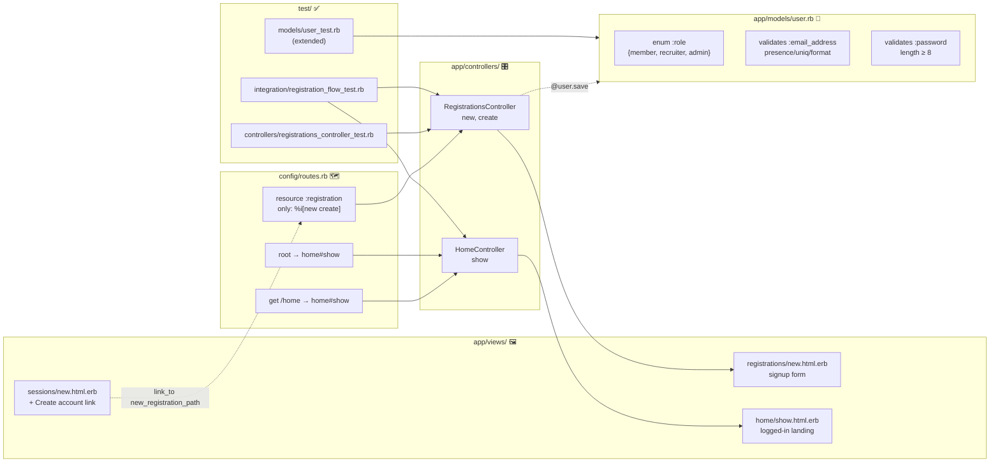
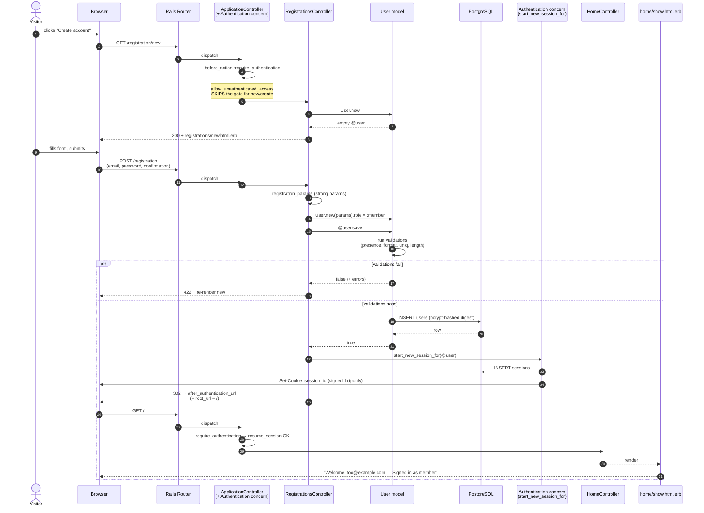
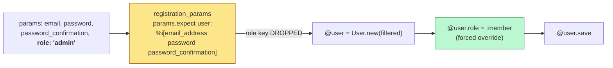
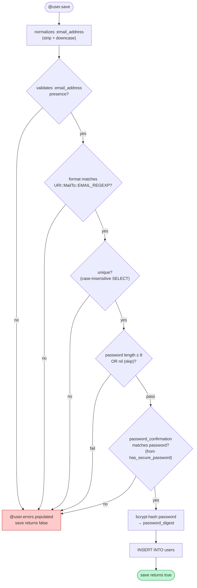
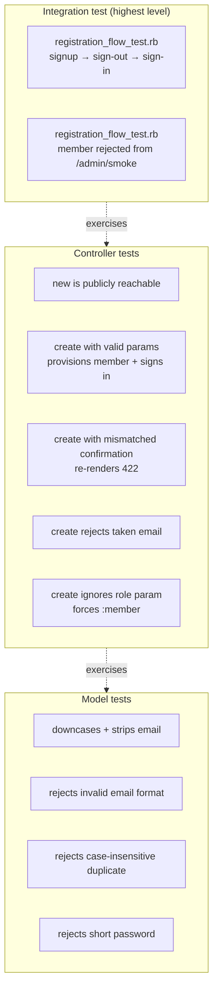
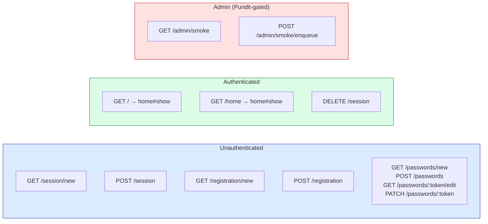

# `member-self-registration` — what shipped, why, and how Rails wires it together

A walkthrough for a TypeScript engineer learning Rails. Every section maps a Rails idiom to its TS/Node analogue.

---

## TL;DR — what this branch achieves

Before this branch, the app had **sign-in / sign-out / password-reset**, but no way for a brand-new visitor to *create* an account — operators had to pre-seed users. This branch closes that gap: a public signup form provisions a fresh `User` with the `member` role and immediately starts a session, dropping the visitor on a logged-in home page.

| Capability | Before | After |
|---|---|---|
| Public signup form | ❌ | ✅ `GET /registration/new` |
| Account creation endpoint | ❌ | ✅ `POST /registration` |
| Auto sign-in after signup | ❌ | ✅ session cookie set |
| Default landing page | `admin/smoke#show` (admin-only, awkward) | `home#show` |
| Role assignment on signup | n/a | Forced to `:member` (privilege-escalation-safe) |
| Email/password validations on `User` | only `normalizes` | presence, uniqueness (case-insensitive), RFC format, ≥8 char password |
| Rate limiting on signup | n/a | 10 / 3 minutes |

---

## File-by-file responsibilities



### New files

| File | Role | TS/Node mental model |
|---|---|---|
| `app/controllers/registrations_controller.rb` | Handles `GET /registration/new` (render form) and `POST /registration` (create user + sign in). | An Express router/handler pair: `router.get('/registration/new', ...)` + `router.post('/registration', ...)`. |
| `app/controllers/home_controller.rb` | Landing page for authenticated users. | A protected `GET /` route that renders the SPA shell or dashboard. |
| `app/views/registrations/new.html.erb` | The signup form. ERB = HTML with embedded Ruby. | A server-rendered React/Next page or an EJS/Pug template. |
| `app/views/home/show.html.erb` | The post-login welcome page. | Same — server-rendered template. |
| `test/controllers/registrations_controller_test.rb` | Per-action controller tests. | Supertest-style HTTP tests against the controller. |
| `test/integration/registration_flow_test.rb` | End-to-end happy-path test that cuts across signup → sign-out → sign-back-in. | Playwright/Cypress-lite — but in-process, no browser. |

### Modified files

| File | What changed | Why |
|---|---|---|
| `config/routes.rb` | Added `resource :registration` (singular), added `home` route, moved `root` from `admin/smoke#show` to `home#show`. | Wire up new endpoints; visitors hitting `/` should land somewhere user-friendly, not an admin diagnostic page. |
| `app/models/user.rb` | Added validations for `email_address` (presence, uniqueness, format) and `password` (min 8 chars, `allow_nil: true`). | Without these, the registration form would happily save garbage. `allow_nil: true` is critical — see §"`has_secure_password` interaction" below. |
| `app/views/sessions/new.html.erb` | Added a "Create account" link next to "Forgot password?". | Discoverability — users on the sign-in page need a way *to* the signup page. |
| `bin/dev` | Added `bin/rails db:prepare` to self-heal the schema on container rebuild. | Quality-of-life for the dev container; unrelated to the feature itself but bundled in. |
| `test/models/user_test.rb` | New tests for the validations above. | Lock down the new model contract. |
| `test/controllers/passwords_controller_test.rb` | Tweaked passwords from `"new"` / `"no"` to ≥8-char strings. | Now that `User` enforces 8-char minimum, the old test fixtures would fail validation. |
| `.gitignore` | Ignores `/.feedback/`. | Local artifact directory; orthogonal. |
| `app/assets/builds/tailwind.css` | Recompiled Tailwind output. | Auto-generated; downstream of view changes. |

---

## The Rails-isms a TS dev should pin down

### 1. `resource :registration` (singular) vs `resources :passwords` (plural)

```ruby
resource  :registration, only: %i[new create]   # singular
resources :passwords,    param: :token          # plural
```

Singular `resource` means **"there is one of this from the current actor's point of view"** — there's no `:id` in the URL, because the current visitor only registers themselves. Compare:

| | Singular `resource :registration` | Plural `resources :passwords` |
|---|---|---|
| Form URL | `POST /registration` | `POST /passwords` |
| Edit URL | `GET /registration/edit` | `GET /passwords/:token/edit` |
| Index? | ❌ no | ✅ yes |

TS analogue: think `/me` style endpoints (no id) vs `/users/:id` style endpoints.

### 2. The 7 RESTful actions and which we exposed

Rails' convention is that each `resource(s)` declaration *can* generate up to 7 actions: `index, show, new, create, edit, update, destroy`. We took only **2**:

```ruby
resource :registration, only: %i[new create]
```

- `new` → `GET /registration/new` → render the form (no DB write)
- `create` → `POST /registration` → process the form (DB write)

We deliberately **don't** expose `edit/update/destroy` — once you've signed up, profile management lives elsewhere (or doesn't exist yet).

### 3. The controller in 30 lines, annotated

```ruby
class RegistrationsController < ApplicationController
  allow_unauthenticated_access only: %i[new create]   # ① bypass auth gate
  rate_limit to: 10, within: 3.minutes, only: :create, # ② built-in throttle
             with: -> { redirect_to new_registration_path, alert: "Try again later." }

  def new
    @user = User.new                                   # ③ empty model for form_with
  end

  def create
    @user = User.new(registration_params)              # ④ build from params
    @user.role = :member                               # ⑤ FORCE role server-side

    if @user.save                                      # ⑥ runs validations + INSERT
      start_new_session_for(@user)                     # ⑦ sets signed cookie
      redirect_to after_authentication_url, notice: "Welcome! Your account has been created."
    else
      render :new, status: :unprocessable_entity       # ⑧ re-render with @user.errors
    end
  end

  private

  def registration_params
    params.expect(user: %i[email_address password password_confirmation])  # ⑨ strong params
  end
end
```

| # | What it does | TS analogue |
|---|---|---|
| ① | `ApplicationController` includes the `Authentication` concern, which adds `before_action :require_authentication`. We opt this controller's two actions out. | Express middleware: `app.use(requireAuth)` then `router.get('/signup', skipAuth, handler)`. |
| ② | Rails 8 ships built-in rate limiting backed by the cache store. 10 attempts per 3 min per IP. | `express-rate-limit`. |
| ③ | The view binds to a model instance. An empty `User.new` lets `form_with model: @user` generate the right field names and URL. | Like initializing a React form with `defaultValues: {}`. |
| ④ | `User.new(hash)` is just a constructor — **no DB I/O yet**. | `new UserEntity(dto)` in TypeORM/Prisma. |
| ⑤ | **Critical security primitive.** Even if the request body contains `role: "admin"`, we overwrite it. Strong params (⑨) also wouldn't permit it, but belt-and-braces. | Server-side authoritative assignment — never trust the client. |
| ⑥ | `.save` returns `true`/`false`. If validations fail, it returns `false` and populates `@user.errors`. If they pass, it runs `INSERT`. | Like calling `.validate()` then `.save()` in TypeORM, fused into one call. |
| ⑦ | Helper from the `Authentication` concern — creates a `Session` row, sets a signed cookie. | `req.session.userId = user.id` after `passport.login`. |
| ⑧ | Re-render the form, but with HTTP 422. Turbo (the JS layer) uses the 422 status to know "this is a form error, swap the form back in" rather than navigate. | A 422 with the validation errors in the JSON body — but here it's HTML. |
| ⑨ | `params.expect` (Rails 8) — strict allowlist. Only these keys reach the model. **Rejects unknown keys** (the older `params.permit` would silently drop them; `expect` raises). | `zod.object({...}).strict().parse(req.body.user)`. |

### 4. The `User` model — what `has_secure_password` gives you

```ruby
class User < ApplicationRecord
  enum :role, { member: 0, recruiter: 1, admin: 2 }
  has_secure_password
  has_many :sessions, dependent: :destroy
  normalizes :email_address, with: ->(e) { e.strip.downcase }

  validates :email_address,
            presence: true,
            uniqueness: { case_sensitive: false },
            format: { with: URI::MailTo::EMAIL_REGEXP }
  validates :password, length: { minimum: 8 }, allow_nil: true
end
```

**`has_secure_password`** (built into Rails) injects:

- a `password` *virtual* attribute (writeable, not a column)
- a `password_confirmation` *virtual* attribute
- bcrypt hashing into a `password_digest` column on save
- `User.authenticate_by(email_address:, password:)` class method
- a confirmation validator that fires when `password_confirmation` is set

Think of it as: "give me a column called `password_digest`, and you get login + bcrypt for free."

#### Why `allow_nil: true` on the password length validator matters

```ruby
validates :password, length: { minimum: 8 }, allow_nil: true
```

When you load a user from the DB to update their *email*, `user.password` is `nil` (it's virtual; only set when you assign it). Without `allow_nil: true`, every email update would fail with "password too short". With it, the validator only runs when password is actually being set — which is exactly the cases we want to validate (signup, password reset).

#### `enum :role` — what's actually generated

```ruby
enum :role, { member: 0, recruiter: 1, admin: 2 }
```

This generates predicate and bang methods at runtime:

- `user.member?` → `true`/`false`
- `user.admin?` → `true`/`false`
- `user.admin!` → updates and saves
- `User.member` → scope returning all members
- The DB column stores the integer; Ruby sees the symbol.

TS analogue: a TypeScript string-literal union plus a hand-rolled `isAdmin()` method, but generated.

### 5. `normalizes` runs before validation

```ruby
normalizes :email_address, with: ->(e) { e.strip.downcase }
```

This means `" Foo@Example.COM "` becomes `"foo@example.com"` *before* the uniqueness check. So a uniqueness validator with `case_sensitive: false` is technically redundant given the normalization, but it's defense-in-depth — if someone bypasses normalization, the validator still catches it.

---

## The full registration flow as a sequence



---

## Why role-on-create matters: the privilege-escalation defense



Two layers protect against a hand-crafted POST trying to mint themselves an admin:

1. **`params.expect`** — the `role` key is not on the allowlist, so it's stripped before it reaches the model.
2. **`@user.role = :member`** — even if step 1 were bypassed, the controller overwrites whatever was there.

This is verified by the test `"create ignores a role parameter and forces member"` in `test/controllers/registrations_controller_test.rb:59`.

---

## Validation chain on `User.save`



---

## Test pyramid for this feature



Three concerns, three layers — each layer can fail independently, and each is fast to run because Rails uses **transactional fixtures** (each test runs inside a DB transaction that's rolled back at the end).

| Layer | TS analogue |
|---|---|
| Model (`ActiveSupport::TestCase`) | Pure unit tests on a domain entity. |
| Controller (`ActionDispatch::IntegrationTest`) | Supertest against a single route. |
| Integration | Supertest covering a multi-request user journey, but in-process. |

---

## Routes after this branch



Run `bin/rails routes -g registration` to see the actual route table:

```
       new_registration GET    /registration/new(.:format)   registrations#new
           registration POST   /registration(.:format)       registrations#create
```

---

## "Coming from TS, what felt magical and what is it actually?"

| Looks like magic | What it really is |
|---|---|
| `User.new(params)` builds an object whose fields match form names | Convention: `params[:user][:email_address]` maps to attribute `email_address` because both `form_with model: @user` and `params.expect(user: ...)` agree on the wrapping. |
| `@user.errors.full_messages` just exists after `save` returns false | Validations populate `errors` as a side effect — there's no exception. The model is the validation result. |
| `start_new_session_for(@user)` is callable but isn't defined in `RegistrationsController` | It comes from the `Authentication` concern mixed into `ApplicationController`. Concerns = mixin modules with a small DSL. Closest TS analogue: a base class with helper methods, or a composition root. |
| `redirect_to root_url` knows the URL | Rails generates `*_url` and `*_path` helpers from `config/routes.rb`. `root` route → `root_url`. |
| `link_to "Create account", new_registration_path` | Same — `resource :registration` generates `new_registration_path`. Type-safe by virtue of being generated; if you mistype, the test fails at boot. |
| `has_secure_password` adds five things at once | Class macro that mutates the class — equivalent to a TS decorator stacking multiple behaviors. |

---

## Loose ends / things to notice

- **`bin/dev` change is orthogonal.** `bin/rails db:prepare` runs every dev startup so a fresh devcontainer rebuild auto-creates schemas. Useful, but unrelated to registration.
- **Tailwind CSS rebuild** is auto-generated output from the new view markup; it's noise in the diff.
- **`/home` route is redundant** with `root` — both point to `home#show`. The named route exists if anything wants to `link_to "Home", home_path`.
- **No email verification.** A signup is immediately a logged-in member. If verification is required later, it'd plug in between `@user.save` and `start_new_session_for`.
- **The `passwords_controller_test.rb` change isn't a feature change** — it's just bumping fixture passwords above the new 8-char minimum so existing tests stay green.

---

## One-paragraph mental model

> Rails routes turn HTTP verbs+paths into controller actions. `RegistrationsController#create` receives a filtered params hash, hands it to `User.new`, calls `.save`, and that single call cascades through email normalization → presence/format/uniqueness/length validations → bcrypt hashing → INSERT. On success, the controller asks the `Authentication` mixin to mint a `Session` row and stamp a signed cookie, then 302s to `/`, where `HomeController#show` greets the now-authenticated user. The `member` role is set server-side, never trusted from the client, and verified by both controller-level and integration-level tests.
