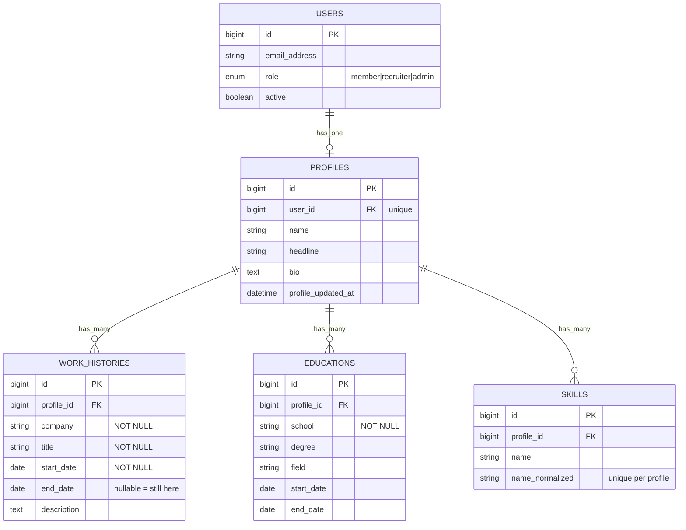
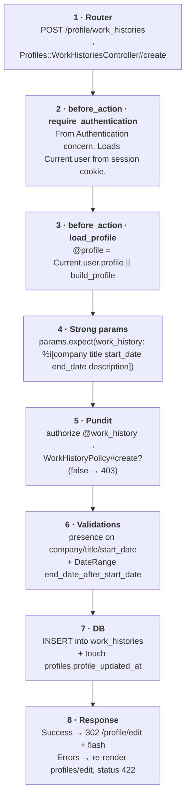

# What this Rails branch actually does

> A walkthrough of the **basic-profile** feature aimed at a TypeScript engineer. We map every Rails concept onto something familiar (Express / NestJS / Prisma), and then read the actual code in this repo.

**Legend** — Routes · Controllers · Policies (Pundit) · Models (ActiveRecord) · Concerns (mixins) · Views (ERB) · Database / migrations.

## Contents

1. [The feature in one paragraph](#1-the-feature-in-one-paragraph)
2. [Rails vs TypeScript — mental model](#2-rails-vs-typescript--mental-model)
3. [The layers introduced by this branch](#3-the-layers-introduced-by-this-branch)
4. [Data model](#4-data-model)
5. [Routes](#5-routes)
6. [Request lifecycle (an "Add work history" click)](#6-request-lifecycle-an-add-work-history-click)
7. [Models & ActiveRecord](#7-models--activerecord)
8. [Authorization with Pundit](#8-authorization-with-pundit)
9. [Controllers in detail](#9-controllers-in-detail)
10. [Concerns — Ruby's mixin pattern](#10-concerns--rubys-mixin-pattern)
11. [Views & partials](#11-views--partials)
12. [Subtle bits worth understanding](#12-subtle-bits-worth-understanding)
13. [Cheatsheet — what each file is responsible for](#13-cheatsheet--what-each-file-is-responsible-for)

---

## 1. The feature in one paragraph

A signed-in **member** can edit *their own* profile: a basic info card (name / headline / bio), plus three list-style sections — **work history**, **education**, and **skills**. Everything happens on a single page `/profile/edit`, with each list item driven by its own nested resource (`POST /profile/work_histories`, `PATCH /profile/work_histories/:id`, etc.). Authorization is enforced by **Pundit** policies: only the profile owner (and only if they're an active member) can mutate their data.

---

## 2. Rails vs TypeScript — mental model

If you've used NestJS + Prisma, this maps cleanly. Rails just bundles all of these into one framework with strong conventions:

| Rails concept | TS equivalent | What this branch does with it |
| --- | --- | --- |
| **Route** · `config/routes.rb` | Express router / Nest `@Controller` decorators | RESTful URLs that auto-generate path helpers like `edit_profile_path`, `profile_skill_path(skill)`. |
| **Controller** · `app/controllers/*` | Express handler / Nest controller method | One Ruby class per resource. Methods like `create`/`update`/`destroy` map to HTTP verbs by convention. |
| **ActiveRecord model** · `app/models/*` | Prisma client + Zod validators, fused | Class = ORM mapper + validation + business rules. `belongs_to :profile` sets up the relation. |
| **Migration** · `db/migrate/*` | Prisma migration / Drizzle SQL migration | Each file is one DDL change. Rails generates `db/schema.rb` from the cumulative state. |
| **Policy (Pundit)** · `app/policies/*` | NestJS guards / CASL abilities | One `FooPolicy` per model with predicates (`create?`, `destroy?`). `authorize @foo` in the controller fails fast with 403. |
| **Concern** · `app/**/concerns/*` | TS mixin / interface with default implementations | A Ruby module designed to be `include`d. Used here for `DateRange` (shared validator) and `ProfileScopedPolicy` (shared `own_profile?`). |
| **View / ERB partial** · `app/views/**/_*.html.erb` | JSX-on-the-server (think Astro components rendered by Express) | Partial templates (filename starts with `_`) that get rendered server-side, sprinkled with form helpers. |
| `Current.user` | `AsyncLocalStorage` with the current request's user | Request-scoped global so you don't pass `req.user` everywhere. Set by `Authentication` concern, read by controllers + Pundit. |
| `params.expect(...)` | Zod / class-validator schema | Rails 8's strict allow-list for incoming params. Anything not listed is dropped (and unexpected shapes raise) — same role as a DTO. |

---

## 3. The layers introduced by this branch

The branch adds a vertical slice across **seven** Rails layers. Reading top-down on a request:

- **Routes** — `config/routes.rb`
  Declares URLs and which controller#action handles each one. Gives you typed helpers (`edit_profile_path`) and RESTful conventions for nested resources.

- **Controllers** — `app/controllers/profiles_controller.rb`, `app/controllers/profiles/{work_histories,educations,skills}_controller.rb`
  Receive HTTP, run `before_action` hooks (auth, profile loading), call `authorize`, mutate models, then redirect or re-render.

- **Policies** — `app/policies/{profile,work_history,education,skill}_policy.rb`, `app/policies/concerns/profile_scoped_policy.rb`
  Pure functions answering "is *this user* allowed to do *this action* on *this record*?" Controllers raise 403 automatically if the answer is no.

- **Models** — `app/models/{profile,work_history,education,skill}.rb`
  ActiveRecord classes. They define associations, validation rules, and small lifecycle callbacks (e.g. `before_validation :normalize_name`).

- **Concerns** — `app/models/concerns/date_range.rb`, `app/policies/concerns/profile_scoped_policy.rb`
  Reusable mixins. `DateRange` adds an "end ≥ start" validator. `ProfileScopedPolicy` shares the "owner-only" rule across child policies.

- **Views / partials** — `app/views/profiles/edit.html.erb`, `app/views/profiles/_basic_form.html.erb`, …
  HTML templates with embedded Ruby. Each section of the page is a partial that takes a `profile` local. Forms render error lists and use Rails URL helpers.

- **Database / migrations** — `db/migrate/2026050921431{1..4}_create_*.rb`, `db/schema.rb`
  Four new tables: `profiles` (1:1 with users), `work_histories` / `educations` (n per profile, ordered by start_date desc), `skills` (unique per profile via a normalized name).

---

## 4. Data model



> **Why a unique index on `(profile_id, name_normalized)`?** So that `"Ruby"` and `"ruby "` collapse to the same skill. The `name_normalized` column is filled by a `before_validation` hook in `Skill` — see §7.

---

## 5. Routes

`config/routes.rb`

```ruby
resource :profile, only: %i[edit update] do
  scope module: :profiles do
    resources :work_histories, only: %i[create update destroy]
    resources :educations,     only: %i[create update destroy]
    resources :skills,         only: %i[create destroy]
  end
end
```

- `resource` (singular) → there's only ever *one* profile per current user, so URLs have no `:id`: `/profile/edit`, `PATCH /profile`.
- `resources` (plural) → many work histories, educations, skills.
- `scope module: :profiles` means *controllers live under the `Profiles::` namespace*, but the **URL stays flat** (`/profile/work_histories/3`), not `/profiles/work_histories/3`. Pure code organization.
- Routes auto-generate path helpers used in views: `edit_profile_path`, `profile_work_history_path(entry)`, `profile_skills_path`.

#### The eight URLs this branch adds

| Verb | Path | Controller#action |
| --- | --- | --- |
| GET | `/profile/edit` | `profiles#edit` |
| PATCH | `/profile` | `profiles#update` |
| POST | `/profile/work_histories` | `profiles/work_histories#create` |
| PATCH | `/profile/work_histories/:id` | `profiles/work_histories#update` |
| DELETE | `/profile/work_histories/:id` | `profiles/work_histories#destroy` |
| POST/PATCH/DELETE | `/profile/educations[/:id]` | `profiles/educations#…` |
| POST | `/profile/skills` | `profiles/skills#create` |
| DELETE | `/profile/skills/:id` | `profiles/skills#destroy` |

---

## 6. Request lifecycle (an "Add work history" click)



> **Why the redirect on success?** This is the classic *POST/Redirect/GET* pattern. The browser then issues a fresh `GET /profile/edit` that re-reads from the DB, so a refresh doesn't re-submit the form. On failure we render the page directly (no redirect) so we can keep the in-memory model with its `errors` attached.

---

## 7. Models & ActiveRecord

### Profile

`app/models/profile.rb`

```ruby
class Profile < ApplicationRecord
  belongs_to :user
  has_many :work_histories, -> { order(start_date: :desc, id: :asc) }, dependent: :destroy
  has_many :educations,     -> { order(start_date: :desc, id: :asc) }, dependent: :destroy
  has_many :skills,         -> { order(:name) },                       dependent: :destroy

  validates :name,     length: { maximum: 120 },  allow_blank: true
  validates :headline, length: { maximum: 200 },  allow_blank: true
  validates :bio,      length: { maximum: 2000 }, allow_blank: true
end
```

- `belongs_to :user` declares an FK and adds a `profile.user` getter. Implicitly *required*.
- The lambdas `-> { order(...) }` are default scopes for the association — every time you call `profile.work_histories`, results come back ordered most-recent-first.
- `dependent: :destroy` ⇒ when the profile is deleted, AR calls `destroy` on each child (running their callbacks). The DB has no `ON DELETE CASCADE`; this is enforced in app code.
- Validations are declarative rules. They run on `save` and populate `record.errors` if violated. `allow_blank` means `""` / `nil` skips the rule.

### Skill — the `name_normalized` trick

`app/models/skill.rb`

```ruby
class Skill < ApplicationRecord
  belongs_to :profile, touch: :profile_updated_at

  before_validation :normalize_name

  validates :name,
            presence: true,
            length: { maximum: 100 },
            uniqueness: { scope: :profile_id, case_sensitive: false }

  private

  def normalize_name
    self.name_normalized = name.to_s.strip.downcase
  end
end
```

- `touch: :profile_updated_at` — whenever a Skill is saved/destroyed, AR also `UPDATE`s `profiles.profile_updated_at = NOW()`. That column is what powers the "Last updated…" line on the page.
- `before_validation` runs *before* the validators each save. It writes the cleaned value into `name_normalized` so the DB unique index can do its job.
- `uniqueness: { scope: :profile_id, case_sensitive: false }` is the AR-level check; the DB unique index on `(profile_id, name_normalized)` is the safety net for race conditions. Both exist for a reason — see §12.

### WorkHistory & Education

`app/models/work_history.rb` · `app/models/education.rb`

```ruby
class WorkHistory < ApplicationRecord
  include DateRange
  belongs_to :profile, touch: :profile_updated_at
  validates :company, :title, presence: true, length: { maximum: 200 }
  validates :start_date, presence: true
end
```

Same structure for `Education`. Both `include` the `DateRange` concern (next section), reusing the start/end date validator.

---

## 8. Authorization with Pundit

Pundit gives you one Ruby class per model with predicate methods. The flow is:

1. Controller calls `authorize @record` (or `authorize @record, :create?`).
2. Pundit looks up `FooPolicy` based on the record's class.
3. Calls the matching predicate (`create?`, `update?`, `destroy?`).
4. If it returns `false`, Pundit raises `NotAuthorizedError`, which `Authorization` rescues into a 403 "Forbidden".

### ProfilePolicy

`app/policies/profile_policy.rb`

```ruby
class ProfilePolicy < ApplicationPolicy
  def edit?    = own_profile?
  def update?  = own_profile?

  private
  def own_profile?
    return false unless user&.member? && user.active?
    record.user_id == user.id
  end
end
```

Three checks combined: signed-in member, account active, owns the profile.

### Child policies via concern

`app/policies/concerns/profile_scoped_policy.rb`

```ruby
module ProfileScopedPolicy
  private
  def own_profile?
    return false unless user&.member? && user.active?
    record.profile&.user_id == user.id
  end
end
```

Same idea, but the record is a `WorkHistory` / `Education` / `Skill`, so we hop through `record.profile.user_id`.

```ruby
class WorkHistoryPolicy < ApplicationPolicy
  include ProfileScopedPolicy
  def create?  = own_profile?
  def update?  = own_profile?
  def destroy? = own_profile?
end
```

> **Why a separate concern?** Three policies (`WorkHistoryPolicy`, `EducationPolicy`, `SkillPolicy`) need an identical `own_profile?`. Extracting it into a module keeps the rule defined in *one place*. `ProfilePolicy` defines its own variant because the record itself *is* the profile, not a child.

---

## 9. Controllers in detail

### ProfilesController

`app/controllers/profiles_controller.rb`

```ruby
class ProfilesController < ApplicationController
  before_action :load_profile

  def edit
    authorize @profile
  end

  def update
    authorize @profile
    if @profile.update(profile_params)
      redirect_to edit_profile_path, notice: "Profile updated."
    else
      render :edit, status: :unprocessable_entity
    end
  end

  private

  def load_profile
    @profile = Current.user.profile || Current.user.create_profile!
  rescue ActiveRecord::RecordNotUnique
    @profile = Current.user.reload.profile
  end

  def profile_params
    params.expect(profile: %i[name headline bio])
  end
end
```

- `before_action :load_profile` runs *before every action*. Equivalent to a per-controller middleware that hangs `@profile` on the request.
- `authorize @profile` raises if Pundit says no.
- `params.expect(...)` is Rails 8's strict allow-list. If the body doesn't have a `profile:` key, it raises. If it has unexpected fields, they're dropped. (Older code uses `params.require(:profile).permit(...)` — same idea.)
- `create_profile!` is auto-generated by `has_one :profile` on `User`. Equivalent to: "create the associated profile, set the FK, save, raise on failure."
- The `rescue` clause is a guard against a race: two simultaneous requests both seeing `profile == nil`, both inserting. The unique index on `profiles.user_id` turns the loser into a `RecordNotUnique`; we catch it and reload the now-existing profile.

### Profiles::WorkHistoriesController (representative child controller)

`app/controllers/profiles/work_histories_controller.rb`

```ruby
class Profiles::WorkHistoriesController < ApplicationController
  before_action :load_profile

  def create
    @work_history = @profile.work_histories.build(work_history_params)
    authorize @work_history
    if @work_history.save
      redirect_to edit_profile_path, notice: "Work history added."
    else
      @new_work_history = @work_history
      render template: "profiles/edit", status: :unprocessable_entity
    end
  end

  def update
    @work_history = @profile.work_histories.find(params[:id])
    authorize @work_history
    if @work_history.update(work_history_params)
      redirect_to edit_profile_path, notice: "Work history updated."
    else
      @errored_work_history = @work_history
      render template: "profiles/edit", status: :unprocessable_entity
    end
  end

  def destroy
    @work_history = @profile.work_histories.find(params[:id])
    authorize @work_history
    @work_history.destroy
    redirect_to edit_profile_path, notice: "Work history removed."
  end

  private

  def load_profile
    @profile = Current.user.profile || Current.user.build_profile
  end

  def work_history_params
    params.expect(work_history: %i[company title start_date end_date description])
  end
end
```

- `@profile.work_histories.find(params[:id])` — *scoped* finder. If you try to update someone else's work history by guessing an id, this throws `RecordNotFound` because the row is not in *this profile's* collection. (Pundit is the second line of defense.)
- `build` is "new in memory, FK already set, not yet saved". Equivalent to `new WorkHistory({ profileId: @profile.id, ...params })`.
- On validation failure we re-render the *edit* template (not redirect), and we stash the unsaved record in `@new_work_history` or `@errored_work_history` so the partial can show the user's bad input + error messages — see §11.
- Why `build_profile` here but `create_profile!` in `ProfilesController`? A child create is meaningless without a saved profile. In practice we never reach this controller without a profile (UI gates it), and if we ever did, `save` would create the parent transparently. Defensive but not strictly required.

---

## 10. Concerns — Ruby's mixin pattern

A *concern* is a Ruby `module` meant to be `include`d into a class. Think of it as `extends` + interface defaults in TS, but more like trait composition.

### DateRange

`app/models/concerns/date_range.rb`

```ruby
module DateRange
  extend ActiveSupport::Concern

  included do
    validate :end_date_after_start_date
  end

  private

  def end_date_after_start_date
    return if end_date.blank? || start_date.blank?
    errors.add(:end_date, "must be on or after start date") if end_date < start_date
  end
end
```

The `included do … end` block runs *in the context of the including class* — same as if you'd written `validate :end_date_after_start_date` directly inside `WorkHistory` and `Education`.

### ProfileScopedPolicy

`app/policies/concerns/profile_scoped_policy.rb`

```ruby
module ProfileScopedPolicy
  extend ActiveSupport::Concern

  private

  def own_profile?
    return false unless user&.member? && user.active?
    record.profile&.user_id == user.id
  end
end
```

Three policies all answer "is the requester the owner of the parent profile?" exactly the same way. The concern lets each policy say `include ProfileScopedPolicy` and then just declare *which actions* are allowed.

---

## 11. Views & partials

Rails serves HTML by default. The page is composed bottom-up:

```text
app/views/profiles/edit.html.erb            # the page
├── _basic_form.html.erb                    # PATCH /profile
├── _work_histories.html.erb                # list + “add” form
│     └── _work_history_form.html.erb       # reused for new + edit
├── _educations.html.erb
│     └── _education_form.html.erb
└── _skills.html.erb
```

The leading underscore on filenames marks them as *partials* (must be rendered, can't be served). Rendering looks like:

```erb
<%= render "profiles/work_histories", profile: @profile %>
```

#### Two important UX details to notice in the partials

**Same form, two URLs**

```erb
<%
  url    = entry.persisted? ? profile_work_history_path(entry) : profile_work_histories_path
  method = entry.persisted? ? :patch : :post
%>
<%= form_with model: entry, url: url, method: method, ...>
```

One partial renders both "create" (POST collection URL) and "edit" (PATCH member URL). `persisted?` is true once the record has an `id` from the DB.

**Showing the bad submission**

```erb
<% form_entry = (@errored_work_history&.id == entry.id) ? @errored_work_history : entry %>
<%= render "profiles/work_history_form", entry: form_entry %>
```

If a particular item failed validation, the controller stashed it in `@errored_work_history`. The list partial swaps in that in-memory record (with `.errors` attached) only for that one row — every other row stays in its clean DB state.

#### Other helpers worth knowing

- `form_with model: entry` — generates labeled inputs, a CSRF token, and the right verb based on `persisted?`. The TS-equivalent would be writing `<form>` + `<input>` manually.
- `button_to "Remove", path, method: :delete` — emits a tiny standalone form. Plain `<a href>` can't issue DELETE; this wraps it in a form so the browser actually does a POST with a hidden `_method=delete` field that Rails reinterprets.
- `data: { turbo_confirm: "..." }` — the Turbo (Hotwire) JS picks this up and shows a native `confirm()` before submitting.
- `dom_id(entry)` → e.g. `"work_history_42"`; just a stable id you can target in CSS / tests.

---

## 12. Subtle bits worth understanding

### a. Lazy profile creation

The DB has `profiles.user_id` as a NOT NULL unique FK, but a user is *created* without a profile (registration only writes to `users`). So the first hit to `/profile/edit` creates one on demand:

```ruby
@profile = Current.user.profile || Current.user.create_profile!
```

The `rescue ActiveRecord::RecordNotUnique` catches the case where two simultaneous requests both see "no profile" and both try to insert — the unique index makes one of them fail, and we just reload the row that the other request already inserted.

### b. `touch` + `profile_updated_at`

`belongs_to :profile, touch: :profile_updated_at` on each child means: any time a child is saved or deleted, AR also bumps `profiles.profile_updated_at`. That timestamp drives the "Last updated …" line on the edit page. It's *separate* from the auto-managed `updated_at` column so you can update the profile row itself without affecting it (or vice versa).

### c. Two layers of skill uniqueness

The model has `validates :name, uniqueness: { scope: :profile_id, case_sensitive: false }`. The DB has a unique index on `(profile_id, name_normalized)`. Why both?

- **App-level** gives a friendly form error message and keeps the user's submission in the form.
- **DB-level** is the only thing that actually prevents duplicates under concurrency — two app processes can both pass the AR check and try to insert. The DB will reject one with `RecordNotUnique`.

This branch doesn't catch `RecordNotUnique` in the skills controller — under the rare race the user just sees a 500. That's a known small gap.

### d. `Current` attributes

`Current.user` is set per-request by the `Authentication` concern. It's implemented with `ActiveSupport::CurrentAttributes`, which is essentially Ruby's equivalent of `AsyncLocalStorage` with a clean reset between requests. That's how Pundit's policies pick up the user without the controller passing it in explicitly:

```ruby
# app/controllers/concerns/authorization.rb
def pundit_user
  Current.user
end
```

### e. `scope module: :profiles` vs `namespace`

Both nest controllers under a folder. The difference:

- `namespace :admin do … end` nests **both** the URL prefix (`/admin/...`) *and* the controller path (`app/controllers/admin/...`).
- `scope module: :profiles` nests *only* the controller path. URL stays `/profile/...`.

This branch uses the second so URLs read naturally (`/profile/skills`) while controllers stay grouped (`app/controllers/profiles/`).

### f. `params.expect` vs `params.permit`

Both are allow-lists for incoming data. `permit` just filters; `expect` (Rails 8) additionally *requires* the wrapping key and proper shape, raising a 400-style error if missing. Think Zod's `.parse` vs `.safeParse`.

---

## 13. Cheatsheet — what each file is responsible for

| File | Responsibility |
| --- | --- |
| `config/routes.rb` *(routes)* | Declares URL → controller mapping. Adds `/profile` + 3 nested resources. |
| `db/migrate/2026...11_create_profiles.rb` *(migration)* | Creates `profiles` with unique `user_id` FK + `profile_updated_at`. |
| `db/migrate/...12_create_work_histories.rb` | Creates `work_histories`; NOT NULL on company/title/start_date. |
| `db/migrate/...13_create_educations.rb` | Creates `educations`; only `school` is NOT NULL. |
| `db/migrate/...14_create_skills.rb` | Creates `skills` + unique index on `(profile_id, name_normalized)`. |
| `app/models/profile.rb` *(model)* | Associations, ordered child collections, length validations. |
| `app/models/work_history.rb` / `education.rb` | `belongs_to :profile, touch: …`, presence/length validations, `include DateRange`. |
| `app/models/skill.rb` | Same plus `before_validation :normalize_name` + scoped uniqueness. |
| `app/models/concerns/date_range.rb` *(concern)* | Reusable "end_date ≥ start_date" validator. |
| `app/models/user.rb` | Adds `has_one :profile, dependent: :destroy`. |
| `app/policies/profile_policy.rb` *(policy)* | `edit?`/`update?` = active member & `record.user_id == user.id`. |
| `app/policies/{work_history,education,skill}_policy.rb` | Same idea via the shared concern; only specific verbs are allowed. |
| `app/policies/concerns/profile_scoped_policy.rb` | Shared `own_profile?` implementation for child policies. |
| `app/controllers/profiles_controller.rb` *(controller)* | Lazy profile create-or-load, basic info update. |
| `app/controllers/profiles/work_histories_controller.rb` | Create/update/destroy a work_history scoped to current user's profile. |
| `app/controllers/profiles/educations_controller.rb` | Same shape, for educations. |
| `app/controllers/profiles/skills_controller.rb` | Create/destroy only — skills are immutable once created (you delete and re-add). |
| `app/views/profiles/edit.html.erb` *(view)* | The single edit page; renders four section partials. |
| `app/views/profiles/_basic_form.html.erb` | Form for name/headline/bio. |
| `app/views/profiles/_work_histories.html.erb` + `_work_history_form.html.erb` | List + add form + per-item edit form. Shared form partial. |
| `app/views/profiles/_educations.html.erb` + `_education_form.html.erb` | Same shape, for education entries. |
| `app/views/profiles/_skills.html.erb` | Pill list with inline "add skill" form. |
| `app/views/home/show.html.erb` | Adds an "Edit my profile" link, gated by `policy(profile).edit?`. |

---

*Generated for `kenfdev@gmail.com` · 2026-05-10.*
